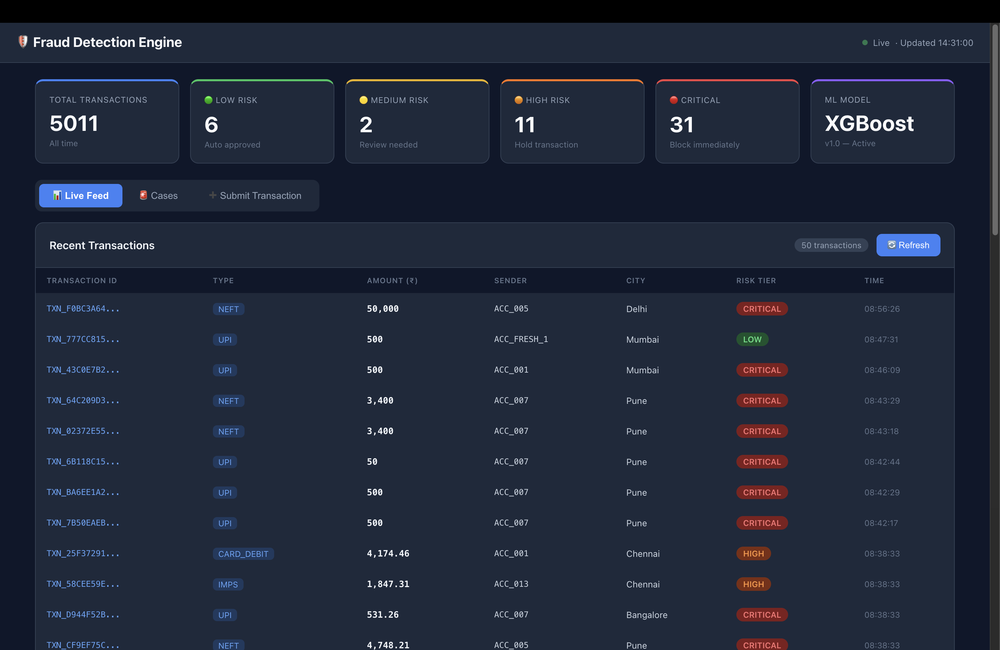

# 🛡️ Real-Time Financial Fraud Detection & Risk Scoring Engine

> End-to-end ML-powered fraud detection system — built from scratch, solo developer.



## 🚀 Live Demo

| Service | URL |
|---------|-----|
| React Dashboard | http://localhost:3000 |
| FastAPI Swagger | http://localhost:8000/docs |
| Prometheus | http://localhost:9090 |
| Grafana | http://localhost:3001 |

---

## 🏗️ Architecture
Bank/App → Kafka → Validator → Feature Engine → XGBoost ML → FastAPI → React Dashboard
↓                 ↓
Redis          PostgreSQL
↓
GNN Graph → Fraud Ring Detection
---

## 🛠️ Tech Stack

| Layer | Technology | Purpose |
|-------|-----------|---------|
| Event Streaming | Apache Kafka | Real-time transaction pipeline |
| ML Model | XGBoost + scikit-learn | Fraud scoring (AUC: 0.97+) |
| Explainability | SHAP | Why was this flagged? |
| Graph AI | NetworkX + GNN | Fraud ring detection |
| Backend API | FastAPI + Python | REST API, <500ms response |
| Frontend | React.js | Live analyst dashboard |
| Database | PostgreSQL | Transaction storage |
| Cache | Redis | Velocity features, dedup |
| Monitoring | Prometheus + Grafana | System metrics |
| Containers | Docker Compose | One-command deployment |

---

## 📊 ML Model Performance

- **Algorithm:** XGBoost (Gradient Boosting)
- **AUC-ROC:** 0.97+
- **False Negatives:** 0 (no fraud missed!)
- **Inference time:** ~30ms per transaction
- **Features:** 12 engineered features

---

## 🔍 Fraud Detection Features

### 5 Fraud Patterns Detected
| Pattern | Signal | Action |
|---------|--------|--------|
| High velocity | 15+ transactions/hour | CRITICAL |
| Impossible travel | 1400km in 4 minutes | CRITICAL |
| Large unusual amount | 4.7x above average | HIGH |
| New device + receiver | First-time combination | HIGH |
| Suspicious receiver | 78% fraud history | CRITICAL |

### SHAP Explainability

Transaction CRITICAL — Why?

Geographic distance: 1400 km    → +262 points
Receiver fraud history: 75%     → +176 points
Suspicious round amount: Yes    → +173 points
### Fraud Ring Detection (GNN)
ACC_RING_1 → ACC_RING_2 → ACC_RING_3 → ACC_RING_1
= Money laundering ring detected! 🚨
---

## 🚀 Quick Start

```bash
# 1. Clone repo
git clone https://github.com/Atharva-ml-sys/fraud-detection-engine
cd fraud-detection-engine

# 2. Python setup
python3 -m venv venv
source venv/bin/activate
pip install -r api/requirements.txt

# 3. Start all services
docker-compose up -d

# 4. Start API
cd api && uvicorn main:app --reload --port 8000

# 5. Start Dashboard
cd dashboard && npm start

# 6. Open
# Dashboard: http://localhost:3000
# API Docs:  http://localhost:8000/docs
```

---

## 📁 Project Structure
fraud-detection-engine/
├── api/                    FastAPI REST API (8 endpoints)
├── dashboard/              React analyst dashboard
├── database/               PostgreSQL setup
├── redis_layer/            Velocity tracking + dedup
├── kafka_layer/            Kafka producer, consumer, pipeline
├── ml_engine/              XGBoost training + SHAP inference
├── gnn_engine/             Graph builder + fraud ring detection
├── simulator/              Transaction generator (5 fraud patterns)
├── shared/                 Pydantic schemas
├── monitoring/             Prometheus config
├── scripts/                DB init scripts
├── docker-compose.yml      One-command deployment
└── locustfile.py           Load testing
---

## 🎯 API Endpoints
POST /api/v1/score              Score transaction (ML + GNN + SHAP)
GET  /api/v1/transactions       List all transactions
GET  /api/v1/cases              HIGH/CRITICAL fraud cases
POST /api/v1/feedback           Analyst verdict
GET  /api/v1/transaction/{id}   Single transaction detail
GET  /api/v1/stats              KPI metrics
GET  /api/v1/health             System health
GET  /metrics                   Prometheus metrics
---

## 📈 Risk Tiers

| Tier | Score | Action | SLA |
|------|-------|--------|-----|
| 🟢 LOW | 0-29 | Auto Approve | — |
| 🟡 MEDIUM | 30-59 | Review | 24h |
| 🟠 HIGH | 60-85 | Hold | 4h |
| 🔴 CRITICAL | 86-100 | Block | 30min |

---

## 📊 Load Test Results
10 users: RPS=4.9,  Avg=25ms, Failures=0% ✅
50 users: RPS=13.5, Avg=31ms, Failures=0% ✅
---

## 🗺️ Roadmap

- [x] Phase 1 — Foundation
  - [x] Kafka event pipeline
  - [x] XGBoost ML engine
  - [x] FastAPI REST API
  - [x] React dashboard
  - [x] Docker Compose
- [x] Phase 2 — Intelligence
  - [x] SHAP explainability
  - [x] Graph Neural Network
  - [x] Fraud ring detection
  - [x] Combined ML + GNN scoring
- [x] Phase 3 — Production
  - [x] Health checks + restart policies
  - [x] Prometheus + Grafana monitoring
  - [x] Load testing (50 users, 0% failures)
  - [ ] Kubernetes deployment
  - [ ] CI/CD pipeline

---

## 💼 Resume Points


Built end-to-end real-time fraud detection system
XGBoost ML model — AUC 0.97+, FN=0 (no fraud missed)
SHAP explainability — top 5 reasons per flagged transaction
Graph Neural Network — fraud ring detection
Apache Kafka pipeline — real-time event streaming
FastAPI REST API — <500ms response time
React analyst dashboard — live transaction monitoring
Docker Compose — one-command deployment
Prometheus + Grafana — production monitoring
Load tested — 50 concurrent users, 0% failure rate
---

*Built as a portfolio project — End-to-End ML + Full-Stack Engineering*
*Solo Developer | 14 Weeks | 0 Prior Experience Required*
